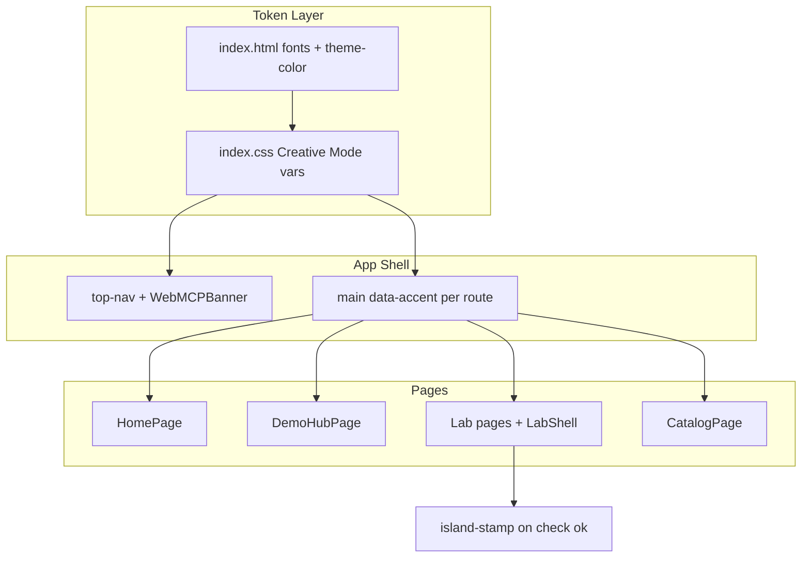

# feat: Creative Mode Kid UI Reskin — Plan

## Goal Capsule

**Objective:** Reskin Inquiry Island with the [Creative Mode](https://github.com/zarazhangrui/beautiful-html-templates/tree/main/templates/creative-mode) design system — full neo-brutalist fidelity for a Grade 2 kid audience across every route, with rotating page accents and a light island mascot on success states.

**Product authority:** Session brainstorm decisions (2026-08-27) are binding unless this plan records an explicit override.

**Open blockers:** None.

---

## Product Contract

### Summary

Replace the current soft blue-gradient UI with Creative Mode's cream canvas, 4px ink borders, hard offset shadows, Archivo Black uppercase display, Space Grotesk body, JetBrains Mono labels, and the green/pink/orange/yellow accent palette. All six routes plus global chrome (nav, WebMCP banner) are in scope. Each route rotates a dominant accent. Success/check feedback includes a light island mascot stamp. Visual memorability for the hackathon demo is the primary success signal; existing accessibility patterns must be preserved.

### Problem Frame

Inquiry Island's P0 scaffold is functionally complete but visually reads as generic ed-tech. The hackathon demo needs a kid-delighting, unmistakably design-forward interface. Creative Mode provides a complete token and component vocabulary; the app has no UI library and styles everything through `src/index.css` and page/component class names — a clean surface for a token-driven reskin.

### Requirements

- R1. The app uses Creative Mode palette tokens: cream `#EFE9D9`, cream-2 `#E4DCC4`, ink `#0F0F0F`, green `#1F8A4C`, pink `#F06CA8`, orange `#E85A1F`, yellow `#F5C518`.
- R2. Typography loads Archivo Black (display), Space Grotesk (body), and JetBrains Mono (labels/meta) via `index.html`.
- R3. Display headlines use Archivo Black uppercase; body copy and lab instructions use sentence case in Space Grotesk for Grade 2 readability.
- R4. Structural surfaces use 4px solid ink borders and hard offset shadows per Creative Mode (no soft blurred drops, no rounded cards except the nav pill badge per source system).
- R5. Every route is reskinned: `/`, `/demo`, `/demo/math`, `/demo/ela`, `/demo/science`, `/catalog`.
- R6. Global chrome (`top-nav`, `WebMCPBanner`, skip link) follows Creative Mode styling.
- R7. Each route declares a rotating dominant accent via a page-level attribute or class; accent assignment is fixed and documented in this plan.
- R8. Lab subject cards and board chrome reflect the route's dominant accent.
- R9. Successful `run_check` results show a light island mascot stamp (🏝 badge/stamp treatment) in addition to existing `aria-live` feedback.
- R10. Existing accessibility behaviors are preserved: skip link, `#main-content` focus target, `aria-*` on labs, 44px touch targets, `:focus-visible` rings, `prefers-reduced-motion` respect.
- R11. WebMCP tools, board reducers, and routing behavior are unchanged — visual layer only.
- R12. `theme-color` and page background align to cream canvas.

### Actors

- A1. **Jordan (Grade 2 kid)** — primary user; should find labs playful and tappable.
- A2. **Hackathon judge** — should remember the demo's visual identity.
- A3. **AI agent (WebMCP)** — unchanged; UI must not obscure tool affordances.

### Key Flows

- F1. Kid lands on home → taps into demo hub → picks a lab → interacts with board → taps Check Answer → sees brutalist success stamp + message.
- F2. Judge opens demo hub → recognizes Creative Mode aesthetic immediately on lab cards and typography.
- F3. User browses catalog → reads standards in brutalist table without horizontal scroll on common laptop widths.

### Acceptance Examples

- AE1. Home page shows cream background, uppercase Archivo Black hero, hard-shadow CTA, green dominant accent.
- AE2. Demo hub lab cards use 4px ink borders, flat accent fills, uppercase card titles; pink dominant accent.
- AE3. Place Value lab block tray and target number use Creative Mode stat/number styling; green dominant accent.
- AE4. After a correct check, `check-result ok` includes a visible island stamp and remains announced via `aria-live`.
- AE5. Catalog table uses ink-bordered cells, cream-2 fill, uppercase column headers in Archivo Black.
- AE6. With `prefers-reduced-motion: reduce`, shadow/hover transitions are suppressed; focus rings still visible.

### Key Decisions

- KD1. **Full Creative Mode fidelity** over kid-softened variant — chosen in visual probe A; maximizes visual wow for judges. *(session-settled: user-directed — chosen over kid-softened B and palette-borrow C: maximum design identity)*
- KD2. **Rotating accents** over fixed subject-color map — each page feels varied rather than Math=green locked. *(session-settled)*
- KD3. **Light mascot on success only** — stamp on check success, not emoji throughout chrome. *(session-settled)*
- KD4. **All routes in one pass** — not demo-only. *(session-settled)*

### Scope Boundaries

**In scope:** CSS token system, font loading, component class updates, optional small presentational components for stamp/badge, accent routing on `main`.

**Deferred for later (product):** Full K–5 catalog expansion, parent/coach panel, animated mascot character, deck-stage slide navigation.

**Outside this product's identity:** Slide-deck runtime (`deck-stage.js`), custom illustration packs, WebMCP protocol changes.

**Deferred to Follow-Up Work:**

- Dark mode / high-contrast theme variant.
- Extracting Creative Mode into a publishable npm package.
- Visual regression screenshot CI.

### Dependencies and Assumptions

- Google Fonts CDN is acceptable for hackathon deploy (Netlify static).
- Creative Mode `design.md` is the authoritative token reference; web font sizes are scaled down from 1920px slide specs to responsive web rem/clamp values.
- Current a11y pass on branch `cursor/p0-vite-scaffold-and-labs` (commit `04b87f2`) is the regression baseline.

### Outstanding Questions

- OQ1 (deferred): Should block emojis (🟦🟩🟨) in Place Value lab be replaced with brutalist color squares? Default: keep emojis for kid recognition; style the tray buttons with ink borders.

---

## Planning Contract

### Summary

Hybrid approach: replace `src/index.css` tokens with Creative Mode variables, add a small set of brutalist utility classes, and wire per-route accent classes in `App.tsx`. No new UI framework. Visual verification is primary proof; existing Vitest board tests must still pass.

### Key Technical Decisions

- KTD1. **Single CSS entry with Creative Mode tokens** — extend `src/index.css` rather than adding CSS-in-JS or a component library. Governs R1, R4, R12.
- KTD2. **Route accent via `data-accent` on `<main>`** — `useLocation()` in `AppShell` sets `data-accent="green|pink|orange|yellow"` per path. Governs R7, R8.

| Route | Dominant accent |
|---|---|
| `/` | green |
| `/demo` | pink |
| `/demo/math` | green |
| `/demo/ela` | pink |
| `/demo/science` | orange |
| `/catalog` | yellow |

- KTD3. **Web-scaled type scale** — map slide tokens to CSS custom properties with `clamp()` (e.g., display hero ~2.5–3.5rem, body 1rem–1.125rem). Governs R2, R3.
- KTD4. **Success stamp as CSS + markup in `LabShell`** — add `.island-stamp` element inside `check-result ok`; no new image assets. Governs R9.
- KTD5. **Preserve a11y selectors** — do not remove `.skip-link`, `:focus-visible`, `@media (prefers-reduced-motion)`, or `aria-*` attributes during reskin. Governs R10.

### High-Level Technical Design

Accent rotation: `AppShell` reads `location.pathname` → sets `data-accent` → CSS `[data-accent="pink"]` rules recolor CTAs, card fills, and highlight bands.

### Assumptions

- No backend or API changes.
- Netlify build continues to emit static `dist/` only.

### Risks and Mitigation

| Risk | Mitigation |
|---|---|
| Uppercase display hurts Grade 2 reading | Body copy and button microcopy stay sentence case; only headings uppercase |
| Hard shadows clip on mobile | Use smaller offset values at `max-width: 640px` |
| Font load flash | `font-display: swap` + system fallback stack |
| Catalog table overflow | Keep `.table-wrap` horizontal scroll; brutalist borders on scroll container |

---

## Implementation Units

### U1. Creative Mode tokens and fonts

**Goal:** Establish the design-system foundation in HTML and CSS.

**Requirements:** R1, R2, R4, R12

**Dependencies:** None

**Files:**
- `index.html`
- `src/index.css`

**Approach:**
1. Add Google Fonts link for Archivo Black, Space Grotesk, JetBrains Mono.
2. Replace `:root` custom properties with Creative Mode palette, typography stacks, shadow tokens (`--shadow-hard`, `--shadow-featured`), spacing scale.
3. Set `body` background to cream; remove blue gradient.
4. Update `theme-color` meta to `#EFE9D9`.

**Patterns to follow:** Creative Mode `design.md` colors and typography sections; existing CSS variable pattern in `src/index.css`.

**Test scenarios:**
- Test expectation: none — token and font setup; verified by build and visual smoke.

**Verification:** `npm run build` succeeds; home page renders cream background and loaded fonts in devtools.

---

### U2. Brutalist component primitives

**Goal:** Define reusable classes for buttons, cards, panels, tables, and stamps.

**Requirements:** R4, R4, R9

**Dependencies:** U1

**Files:**
- `src/index.css`

**Approach:**
1. Reskin `.btn`, `.btn.primary`, `.btn.secondary`, `.btn.danger` with 4px ink border, flat fills, hard shadow on primary.
2. Reskin `.lab-card`, `.lab-shell`, `.target-card`, `.revision-card`, `.object-card` as flat color-block panels.
3. Add `.island-stamp` (rotated pink/cream stamp per Creative Mode `stamp` component, scaled for web).
4. Reskin `.table-wrap`, `th`, `td` for catalog brutalist table.
5. Nav pill: `.topbar-pill` style on active nav link or brand badge (only rounded element).

**Patterns to follow:** Creative Mode `stat-cell`, `step-card`, `table`, `stamp` component specs.

**Test scenarios:**
- Test expectation: none — styling primitives; verified visually per AE1–AE5.

**Verification:** Demo hub cards and a primary button show ink border + hard shadow at desktop and mobile widths.

---

### U3. App shell, accent routing, and banner

**Goal:** Reskin global chrome and wire rotating accents per route.

**Requirements:** R6, R7, R10

**Dependencies:** U1, U2

**Files:**
- `src/App.tsx`
- `src/components/WebMCPBanner.tsx`
- `src/index.css`

**Approach:**
1. In `AppShell`, derive accent from `useLocation().pathname` per KTD2 table; set `data-accent` on `<main>`.
2. Style `.top-nav` with JetBrains Mono uppercase labels, cream-2 bar, ink bottom border.
3. Reskin `WebMCPBanner` as kicker-block (ink bg, cream text) or warn variant (yellow fill).
4. Preserve skip link behavior; reskin `.skip-link` to match Creative Mode CTA.

**Patterns to follow:** Creative Mode `slide-chrome`, `kicker-block`; existing `App.tsx` structure.

**Test scenarios:**
- Navigating `/` → `/demo` → `/catalog` changes `data-accent` on main element.
- Skip link remains first focusable and jumps to `#main-content`.

**Verification:** Manual route walk confirms accent shifts; keyboard tab order unchanged.

---

### U4. Home and demo hub pages

**Goal:** Apply full Creative Mode treatment to marketing/entry surfaces.

**Requirements:** R3, R5, R8

**Dependencies:** U2, U3

**Files:**
- `src/pages/HomePage.tsx`
- `src/pages/DemoHubPage.tsx`
- `src/index.css`

**Approach:**
1. Home: uppercase hero, mono eyebrow kicker, large hard-shadow primary CTA "Start Grade 2 Demo".
2. Demo hub: uppercase `hero-title`, accent-filled lab cards per subject tag, judge prompts in mono-bordered code blocks.
3. Adjust copy only where needed for sentence-case body (`lead` paragraphs).

**Patterns to follow:** `src/pages/DemoHubPage.tsx` structure; visual probe option A layout.

**Test scenarios:**
- Covers AE1. Home shows green-dominant accent, cream canvas, uppercase hero.
- Covers AE2. Demo hub cards have 4px borders and pink dominant accent.

**Verification:** Visual match to probe A fidelity at `/` and `/demo`.

---

### U5. Lab shell, check feedback, and mascot stamp

**Goal:** Reskin lab chrome and add success stamp.

**Requirements:** R9, R10, R11

**Dependencies:** U2, U3

**Files:**
- `src/components/LabShell.tsx`
- `src/index.css`

**Approach:**
1. Reskin header toolbar buttons and `standard-chip` with mono labels.
2. On `lastCheck.passed`, render `.island-stamp` with 🏝 and "Nice work!" (aria-hidden on decorative emoji; message in live region text).
3. Keep `role="status"` / `aria-live` on check result div.
4. Do not change `runCheck`, `undo`, or WebMCP hooks.

**Patterns to follow:** Existing `LabShell.tsx` check-result pattern; Creative Mode `stamp` component.

**Test scenarios:**
- Covers AE4. Correct check shows stamp + ok styling; message still in aria-live region.
- Failed check shows warn styling without stamp.
- Undo/Reset/Check buttons remain keyboard operable with visible focus.

**Verification:** Run math lab, pass check, observe stamp; run with WebMCP banner present.

---

### U6. Lab board surfaces

**Goal:** Reskin the three interactive lab UIs.

**Requirements:** R5, R8, R10, R11

**Dependencies:** U2, U5

**Files:**
- `src/components/PlaceValueLab.tsx`
- `src/components/OpinionBuilderLab.tsx`
- `src/components/MatterLab.tsx`
- `src/index.css`

**Approach:**
1. Place Value: brutalist `target-number` (Archivo Black, accent color), `block-btn` as stacked-block style, `block-area` with dashed ink border.
2. Opinion Builder: form inputs with ink borders; chip buttons as badge style; paragraph preview in cream panel.
3. Matter Lab: object cards as step-cards; classify buttons as flat accent toggles with `aria-pressed`.
4. Preserve all existing `aria-*`, `htmlFor`, fieldset/legend structure from a11y pass.

**Patterns to follow:** Existing lab component markup; Creative Mode `block-btn` / `step-card` patterns.

**Test scenarios:**
- Covers AE3. Math lab target number uses display typography and green accent context.
- Place block button updates board; `aria-pressed` states unchanged on matter lab.
- Opinion form labels still associated with inputs.

**Verification:** Play through each lab briefly; `npm run test` passes.

---

### U7. Catalog page

**Goal:** Brutalist standards table and page chrome.

**Requirements:** R5, R7

**Dependencies:** U2, U3

**Files:**
- `src/pages/CatalogPage.tsx`
- `src/index.css`

**Approach:**
1. Page title uppercase; yellow dominant accent on header band or table head row.
2. Table: ink outer border, cream-2 body, ink row dividers, uppercase `th` in Archivo Black.
3. Keep `caption`, `scope="col"`, `translate="no"` on standard codes.

**Patterns to follow:** `src/pages/CatalogPage.tsx`; Creative Mode `table` component.

**Test scenarios:**
- Covers AE5. Table renders with brutalist borders and scroll wrapper on narrow viewports.
- Standard codes remain untranslated.

**Verification:** Catalog loads all grades; horizontal scroll works on 375px width.

---

### U8. Responsive, motion, and regression pass

**Goal:** Polish breakpoints, preserve a11y, confirm no behavioral regressions.

**Requirements:** R10, R12

**Dependencies:** U3–U7

**Files:**
- `src/index.css`
- (minor touch-ups across prior files if clipping found)

**Approach:**
1. Add mobile rules: reduced shadow offsets, stacked lab header actions (existing breakpoint).
2. Confirm `@media (prefers-reduced-motion: reduce)` disables transform transitions on stamp/cards.
3. Run full verification suite.

**Patterns to follow:** Existing `prefers-reduced-motion` block in `src/index.css`.

**Test scenarios:**
- Covers AE6. With reduced motion enabled, no translateY hover on cards.
- `npm run typecheck`, `npm run test`, `npm run build` all pass.

**Verification:** All three commands exit 0; quick keyboard-only walkthrough of home → demo → math lab.

---

## Verification Contract

| Command | Expectation |
|---|---|
| `npm run typecheck` | Exit 0 |
| `npm run test` | All board reducer tests pass (4+) |
| `npm run build` | Production build succeeds |
| `npm run dev` | Manual visual smoke: all 6 routes + check stamp |

**Visual smoke matrix:**

1. `/` — green accent, cream canvas, uppercase hero
2. `/demo` — pink lab cards
3. `/demo/math` — place blocks, check answer, success stamp
4. `/demo/ela` — form usable
5. `/demo/science` — classify + temperature slider
6. `/catalog` — table scroll + headers

---

## Definition of Done

- [ ] All requirements R1–R12 satisfied on `cursor/p0-vite-scaffold-and-labs` (or successor branch)
- [ ] Acceptance examples AE1–AE6 verified manually
- [ ] No changes to `src/boards/`, `src/webmcp/`, or reducer tests beyond incidental className updates
- [ ] `theme-color` and fonts load on Netlify preview
- [ ] Implementation units U1–U8 complete

---

## Appendix

### Source reference

- Creative Mode design system: https://github.com/zarazhangrui/beautiful-html-templates/tree/main/templates/creative-mode
- Key files: `design.md`, `template.json`

### Product Contract preservation

Product Contract authored at plan-write from session brainstorm (`ce-plan-bootstrap`). No prior written requirements artifact to diff.
