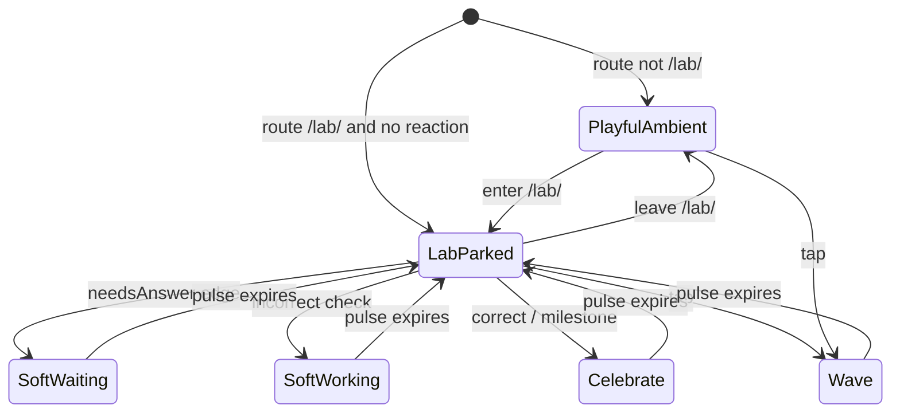

# Pet Lab Event Sync - Plan

## Goal Capsule

**Objective:** Change the ambient lab buddy so that during labs it no longer roams constantly; instead it parks calmly while the kid solves and delivers fun through learning-synced reactions plus optional tap cheer, while home/hub can stay playful.

**Product authority:** ce-brainstorm dialogue (2026-09-02) refining attention behavior of the shipped ambient pet from `docs/plans/2026-09-01-001-feat-ambient-island-pet-plan.md`. Surrounding gamification systems (XP, badges, streaks) and any future interactive hint companion are not active scope.

**Open blockers:** None.

---

## Product Contract

### Summary

In labs, the ambient pet stops constant left-to-right roaming and becomes an event-synced buddy: parked and calm while solving, auto-reacting on real learning moments, plus an optional tap cheer. Home and hub keep a more playful ambient presence so delight still exists outside board work.

### Problem Frame

Continuous idle patrol pulls peripheral attention during the exact window when Grade 2 kids need board focus for subject comprehension. Gamified motion already competes with learning; the ambient pet should feel like a friend who reacts to progress, not like a screensaver running through every problem.

### Key Decisions

- KD1. **Event-synced buddy + invite cheer (Approach B)** over park-and-celebrate-only and solve-minimized token. Fun rides on learning timing, not constant motion. *(session-settled: user-directed — chosen over A and C: richer fun-while-learning without roam)* Governs R1, R2, R3, R4, R5, R6.
- KD2. **Quieter contract in labs only** over making the whole app calm. Distraction risk is during comprehension work; home/hub may stay playful. *(session-settled: user-directed — chosen over everywhere-quiet and labs+all-work-screens: problem is lab focus)* Governs R1, R7.
- KD3. **Progress-mirror + optional tap** over quiet-only or tap-only. Auto delight on learning events and invited play both stay. *(session-settled: user-directed — chosen over auto-only and tap-only)* Governs R2, R3, R5.
- KD4. **Waiting/stuck cues stay softer than celebrations** so mid-solve empathy does not recreate distraction. *(session-settled: user-approved — confirmed with scoping synthesis call-out)* Governs R3.
- KD5. **Pet is not a hint/help companion.** Optional tap is cheer/play only; it must not become a second instructional helper surface. Governs R6.

### Actors

- A1. **Jordan (Grade 2 kid)** — works labs for subject comprehension; notices pet delight on wins without losing board focus mid-solve.
- A2. **Helper / parent** — may still hide the pet if needed; should rarely need to because lab motion stays calm.

### Key Flows

- F1. Mid-lab solve
  - **Trigger:** Kid is in an active lab and no learning event just fired.
  - **Actors:** A1
  - **Steps:** Pet remains visible in the buddy lane, parked (no L→R patrol loop); sprite stays calm/idle-in-place.
  - **Outcome:** Board holds attention; pet does not roam.
  - **Covered by:** R1, R4
- F2. Learning-synced auto reaction
  - **Trigger:** Learning state changes (correct check, waiting/needs answer, stuck/struggle signal, or milestone the product already surfaces).
  - **Actors:** A1
  - **Steps:** Pet plays a brief reaction appropriate to the event; waiting/stuck stay softer than celebrate; reaction auto-expires back to parked calm.
  - **Outcome:** Fun mirrors progress without a lasting motion loop.
  - **Covered by:** R2, R3, R4
- F3. Invite cheer
  - **Trigger:** Kid taps the pet during a lab.
  - **Actors:** A1
  - **Steps:** Short cheer/wave/play beat and optional line; returns to parked calm; no hint panel or care UI opens.
  - **Outcome:** Optional play without requiring interaction to finish the lab.
  - **Covered by:** R5, R6
- F4. Home / hub playful ambient
  - **Trigger:** Kid is on home or hub (non-lab).
  - **Actors:** A1
  - **Steps:** Pet may use playful ambient motion (including patrol-style roam) and occasional flourish.
  - **Outcome:** Outside labs, the buddy still feels alive.
  - **Covered by:** R7
- F5. Hide preference unchanged in role
  - **Trigger:** Helper or kid hides the pet via existing preference / long-press hide.
  - **Actors:** A1, A2
  - **Steps:** Pet stays hidden across reload until shown again.
  - **Outcome:** Escape hatch remains; this work does not depend on hide as the primary fix.
  - **Covered by:** R8

### Requirements

**Lab attention**

- R1. While the kid is in an active lab and no reaction is playing, the pet must not run a continuous left-to-right patrol; it stays parked in the buddy lane (calm in-place idle is allowed).
- R2. In labs, the pet auto-reacts to real learning state changes: at least correct check, waiting/needs-answer, and a stuck/struggle signal when the app can detect one, plus any existing milestone the product already celebrates.
- R3. Waiting and stuck auto-reactions must be clearly softer (less motion/speech intensity and/or shorter) than correct-check celebrations.
- R4. Lab reactions auto-expire and return to parked calm; they must not leave the pet in a lasting roam or celebrate loop.

**Invite play**

- R5. Soft tap/click on the pet during a lab triggers a short cheer/play beat, then returns to parked calm.
- R6. Tap cheer must not open instructional help, care panels, or other chrome that turns the pet into a helper UI.

**Outside labs**

- R7. On home and hub, the pet may remain playfully ambient (including patrol-style motion and occasional flourish); the quieter parked contract is lab-scoped.

**Preserved escape hatch**

- R8. Existing hide/show preference and long-press hide continue to work; this change must not require hiding the pet to make labs usable.

**Accessibility**

- R9. `prefers-reduced-motion: reduce` continues to suppress roam and large motion loops; event reactions, if any, stay minimal or static.

### Acceptance Examples

- AE1. Mid-lab park
  - **Covers:** R1
  - **Given:** Kid is in a lab with no recent check or tap.
  - **When:** Several seconds pass.
  - **Then:** Pet stays in the buddy lane without repeating L→R patrol walks.
- AE2. Correct-check delight
  - **Covers:** R2, R4
  - **Given:** Kid submits a correct check in a lab.
  - **When:** The celebration fires.
  - **Then:** Pet shows a clear celebrate beat (motion and/or speech), then returns to parked calm.
- AE3. Softer stuck/waiting
  - **Covers:** R3
  - **Given:** Lab board needs an answer or a stuck signal fires.
  - **When:** The auto reaction plays.
  - **Then:** The reaction is visibly/audibly milder and/or shorter than a correct-check celebration.
- AE4. Tap invite
  - **Covers:** R5, R6
  - **Given:** Kid is mid-lab.
  - **When:** They tap the pet.
  - **Then:** A short cheer plays and ends; no hint/care panel opens.
- AE5. Home still playful
  - **Covers:** R7
  - **Given:** Kid is on home or hub with the pet visible and motion allowed.
  - **When:** They watch the buddy lane briefly.
  - **Then:** Playful ambient motion (such as patrol) remains available.
- AE6. Hide still works
  - **Covers:** R8
  - **Given:** Pet is visible.
  - **When:** Helper hides it via preference or long-press confirm.
  - **Then:** Pet stays gone across reload until shown again.
- AE7. Lab then home
  - **Covers:** R7
  - **Given:** Kid finished a lab and navigates to home or hub.
  - **When:** They watch the buddy lane with motion allowed.
  - **Then:** Playful ambient motion is available again (quieter lab contract does not stick).

### Success Criteria

- SC1. Kids still smile at celebrations (delight preserved).
- SC2. During mid-solve, eyes stay on the board rather than tracking continuous pet roam (distraction proxy; no hard metric yet).
- SC3. Helpers should rarely need to hide the pet solely because of lab motion.

### Scope Boundaries

**In scope:**
- Lab parked/no-patrol idle behavior
- Learning-synced auto reactions with softer waiting/stuck than celebrate
- Optional tap cheer during labs
- Keeping home/hub playful ambient motion
- Preserving hide preference and reduced-motion behavior

**Out of scope / deferred:**
- Solve-minimized near-invisible token mid-solve
- Returning hatch/care economy or pet-care mini-game
- Building a new interactive hint companion (or assigning that job to the pet)
- Broad changes to XP, badges, or streak systems beyond pet reactions that reflect them
- Replacing or redesigning lab board pedagogy itself

### Dependencies / Assumptions

- Assumes the current ambient pet (footer buddy lane, activity→mood mapping, tap wave, long-press hide, reduced-motion gate) remains the base surface to refine.
- Distraction success uses the mid-solve attention proxy in SC2 until classroom observation exists.
- There is no shipped interactive `IslandCompanion` today; KD5 is a product boundary, not preservation of live companion chrome.

### Outstanding Questions

**Resolve Before Planning:** None.

**Deferred to Planning:** (resolved below as KTDs / Assumptions)

### Sources / Research

- Prior ambient pet plan: `docs/plans/2026-09-01-001-feat-ambient-island-pet-plan.md` (implementation-ready; this plan refines lab attention behavior).
- Current idle patrol: `src/hooks/usePetPatrol.ts`, `src/services/petPatrol.ts`, `src/components/IslandPet.tsx`.
- Activity→mood map: `src/services/petActivity.ts`.
- Hide preference: `src/services/pet.ts`, Progress scoreboard toggle, long-press hide on `IslandPet`.

<!-- ce-section: work-relationships -->
### How This Work Fits Together

This plan owns **lab attention behavior for the ambient pet** (park mid-solve; event-synced fun; optional tap; home/hub may stay playful). The broader ambient-pet introduction is already captured elsewhere and is context, not a roadmap commitment.

- Ambient floating Island Pet (`docs/plans/2026-09-01-001-feat-ambient-island-pet-plan.md`)
  - **Shares** ambient pet presence, activity→mood idea, hide preference, reduced-motion
  - **This plan depends on** that pet already existing as the lab buddy surface
  - **Still to decide** in later work: any true interactive hint companion (explicitly not this pet’s job)

---

## Planning Contract

### Assumptions

- A1. Lab quieter contract uses **route presence** `pathname.startsWith("/lab/")`, not sticky `Boolean(app.activeStandard)` (which is never cleared on leave today).
- A2. v1 stuck/struggle signal is the existing incorrect-check → timed `working` reaction; no new struggle detector.
- A3. Home/hub keep today’s patrol timing; no flourish polish in this change set.
- A4. Existing tap → wave remains the invite cheer; no new helper chrome.
- A5. Non-lab, non-home/hub routes (e.g. Progress, subject hubs) may keep playful ambient like home (not lab-quiet) unless they are under `/lab/`.

### Key Technical Decisions

- KTD1. **Route-based in-lab gate** — quieter/no-patrol when `pathname.startsWith("/lab/")`. *(session-settled: user-approved — confirmed over sticky session state: otherwise R7/AE7 break after leaving a lab)* Governs R1, R7.
- KTD2. **Patrol only when idle and not on a lab route** — extend `shouldPatrol` (or equivalent option) so lab idle parks instead of walking. Governs R1.
- KTD3. **Park in place** — when patrol stops for lab/reaction, hold current X; do not snap to lane `minX` (today’s non-patrol path resets to left edge). Governs R1, R4.
- KTD4. **Waiting is a timed soft pulse** — on transition into needs-answer, fire a shorter/softer waiting reaction that expires to parked idle; do not latch sustained `waiting` mood for the whole empty-board period (that fights R4 and blocks calm park). Governs R2, R3, R4.
- KTD5. **Working (stuck proxy) shorter/softer than celebrate** — keep incorrect-check → working, but use a shorter duration and/or gentler pose than celebrate (celebrate may stay near `PET_REACTION_MS`). Governs R3.
- KTD6. **No AppContext lab-session clear required for v1** — route gate is sufficient for quieter vs playful; clearing sticky `activeStandard` may be deferred follow-up if other features need it.

### High-Level Technical Design

### Alternative Approaches Considered

- **Clear sticky `activeStandard` on LabPage unmount** — also fixes AE7, but couples pet attention to session lifecycle and risks breaking other consumers of `activeStandard`. Rejected for v1 in favor of route gate (KTD1/KTD6).
- **Map all in-lab idle to sustained `waiting`** — stops patrol today, but never returns to calm park while board empty and fights R4. Rejected for timed waiting pulse (KTD4).

---

## Implementation Units

### U1. Route-gated lab park + park-in-place

- **Goal:** On `/lab/...`, stop L→R patrol while calm; park without snapping to the left edge; restore patrol off-lab.
- **Requirements:** R1, R7, R9; AE1, AE5
- **Dependencies:** None
- **Files:**
  - Modify: `src/hooks/usePetPatrol.ts`
  - Modify: `src/components/IslandPet.tsx`
  - Modify: `src/services/petPatrol.ts` (only if shared helpers for park/clamp need export)
  - Test: `src/services/petPatrol.test.ts` and/or new `src/hooks/usePetPatrol` pure helpers if extracted
- **Approach:**
  1. Derive `onLabRoute` from `pathname.startsWith("/lab/")` in `IslandPet` (do not use sticky `activeStandard` for quieter gating).
  2. Pass that into patrol so `shouldPatrol` is effectively idle-and-not-on-lab (and still respects reduced-motion `enabled`).
  3. When patrol is disabled, clamp X in place instead of resetting to `bounds.minX`.
  4. Keep reduced-motion: patrol stays off.
- **Patterns to follow:** Existing `usePetPatrol` mood gate; `subjectForSpeech` already uses pathname prefixes.
- **Test scenarios:**
  - Covers AE1. Given idle mood and onLabRoute true, patrol does not begin walks / phase stays paused.
  - Covers AE5. Given idle mood and onLabRoute false, patrol walks are allowed (when enabled).
  - Park-in-place: when walking is interrupted into non-patrol, x stays near prior position (not forced to minX).
- **Verification:** Unit tests green; manual lab mid-solve shows no L→R roam; off-lab idle can roam when mood is idle.

### U2. Softer timed waiting/working vs celebrate

- **Goal:** Learning-synced auto reactions stay; waiting and stuck (working) are shorter/softer pulses that expire to parked calm.
- **Requirements:** R2, R3, R4, R7; AE2, AE3, AE7
- **Dependencies:** U1
- **Files:**
  - Modify: `src/services/petActivity.ts`
  - Modify: `src/services/pet.test.ts`
  - Modify: `src/components/IslandPet.tsx` (wire edge-triggered waiting pulse; duration for working vs celebrate)
  - Optionally modify: `src/data/codexPets.ts` only if miss pose must map softer than `failed`
- **Approach:**
  1. Stop treating persistent `inLab && needsAnswer` as latched `waiting` mood that never expires; prefer idle/parked between pulses.
  2. On rising edge of needs-answer (or equivalent), set a timed soft `waiting` reaction that clears after a shorter window than celebrate.
  3. Keep incorrect-check → `working` as stuck proxy; use a shorter reaction window and/or softer sprite mapping than celebrate.
  4. Celebrate / milestone paths keep a clear, stronger beat then return to parked calm.
  5. With KTD4, leaving `/lab/` returns to idle-capable ambient so AE7 holds with U1's route gate.
- **Execution note:** Implement mood/mapper helpers test-first in `pet.test.ts` before wiring IslandPet.
- **Patterns to follow:** `reactionFromAppEvent`, `PET_REACTION_MS`, existing celebrate expiry effect.
- **Test scenarios:**
  - Covers AE2. Correct/celebrate reaction wins over waiting and expires back to idle.
  - Covers AE3. Waiting pulse duration (or intensity helper) is strictly less than celebrate duration.
  - Covers AE3. Working (miss) duration/intensity helper is strictly less than celebrate.
  - Needs-answer alone does not leave mood latched on `waiting` forever when reaction is null.
  - Covers AE7. After latched-waiting removal, off-lab idle is patrol-eligible again.
- **Verification:** Updated unit tests; manual incorrect then correct shows softer then stronger beats; empty board does not permanently hold waiting pose; home after lab can roam.

### U3. Preserve invite cheer without helper chrome

- **Goal:** Tap cheer still works in labs and returns to parked calm; no hint/care UI.
- **Requirements:** R5, R6, R8; AE4, AE6
- **Dependencies:** U1
- **Files:**
  - Modify: `src/components/IslandPet.tsx` only if needed to ensure wave expiry returns to parked (not patrol restart mid-lab)
  - Touch only if regression: `src/services/pet.ts` (hide prefs — expect no change)
- **Approach:**
  1. Keep click → waving + speech; keep long-press hide.
  2. Confirm lab route + parked idle after wave expiry (U1 gate prevents patrol restart).
  3. Do not wire `labHint`, Show Answer, or StrategyPanel into the pet.
- **Test scenarios:**
  - Covers AE4. Wave reaction path still sets waving and clears without opening panels (characterize existing behavior; add regression assertion if a pure helper is extractable).
  - Covers AE6. Hide preference still toggles visibility (existing `pet.test.ts` prefs cases remain green).
- **Verification:** Manual tap mid-lab → short wave then park; long-press hide still works; no new chrome.

### U4. Acceptance regression coverage for activity + route helpers

- **Goal:** Durable unit coverage for the mapper/route helpers that encode AE1–AE3, AE5, AE7.
- **Requirements:** R1–R4, R7, R9; AE1–AE3, AE5, AE7
- **Dependencies:** U1, U2
- **Files:**
  - Modify: `src/services/pet.test.ts`
  - Modify: `src/services/petPatrol.test.ts` (park/clamp helpers if added)
  - Optionally add: small pure helper tests colocated with any extracted `isLabRoute` / intensity helpers
- **Approach:** Prefer pure-function tests (repo pattern: no RTL). Extract tiny helpers from IslandPet/hook if needed for testability without mounting React.
- **Test scenarios:**
  - Lab route helper true for `/lab/NC.2.NBT.1`, false for `/` and `/grade-2`.
  - Patrol-allowed helper false on lab route even when mood idle; true off-lab when idle.
  - Soft vs celebrate duration/intensity ordering assertions.
  - Reduced-motion remains “patrol disabled” (existing or one regression case).
- **Verification:** `npm test` covers new cases; `npm run typecheck` clean.

---

## Verification Contract

- **Unit:** `npm test` (vitest) — must include new/updated pet activity and patrol helper cases.
- **Typecheck:** `npm run typecheck`
- **Manual (desktop + mobile width):**
  - Mid-lab: no continuous L→R roam while solving (AE1)
  - Correct check: clear celebrate then park (AE2)
  - Miss / empty-board waiting pulse: softer/shorter than celebrate (AE3)
  - Tap: short cheer, no helper panel (AE4)
  - Home after lab: patrol/playful ambient returns (AE5, AE7)
  - Hide preference / long-press hide (AE6)
  - `prefers-reduced-motion`: no roam (R9)

---

## Definition of Done

- All U1–U4 complete with cited requirements covered.
- Unit tests and typecheck pass.
- Manual verification checklist above completed for lab and home/hub.
- Product boundaries held: no hatch/care revival, no hint companion on the pet, no home flourish redesign.
- PR description references this plan and notes route-based in-lab gating (KTD1).
